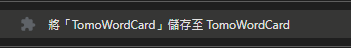
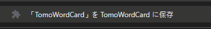
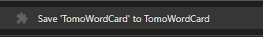

# TomoWordCard

[繁體中文](#繁體中文) | [日本語](#日本語) | [English](#english)

---

## 繁體中文

一款能輕鬆製作單字卡的 Chrome 擴充功能。

### 🛠️ 安裝步驟

1. 複製或下載此Repo至您的本機電腦。
2. 開啟 Google Chrome 瀏覽器並打開**管理擴充功能**頁面 `chrome://extensions/`。
3. 切換右上角的開關以啟用 **開發者模式**。
4. 點擊左上角的 **載入未封裝項目**。
5. 選擇 `ChromeExtension` 資料夾。

### 📝 使用方法

1. **新增單字**：在任何網站上反白單字，點擊右鍵並選擇 `將「{word}」儲存至 TomoWordCard`。
2. **複習單字**：點擊擴充功能圖示，查看按日期分組的儲存列表。點擊任何單字即可快速在 Google 翻譯中查詢。
3. **自我測試**：在輸入框中輸入自訂定義。儲存後它們將被遮罩。按住輸入欄位旁的 `👁️` 按鈕可暫時顯示您的自訂翻譯。
4. **資料攜帶性**：使用底部的按鈕來備份（`匯出備份`）或還原（`匯入單字`）您的單字資料。

---

## 日本語

手軽に単語カードを作成できる Chrome 拡張機能。

### 🛠️ インストール方法

1. このリポジトリをローカルマシンにクローンまたはダウンロードします。
2. Google Chrome を開き、`chrome://extensions/` に移動します。
3. 右上隅のスイッチを切り替えて **デベロッパー モード** を有効にします。
4. 左上隅の **展開型の拡張機能を取り込む** をクリックします。
5. `ChromeExtension` フォルダーを選択します。

### 📝 使い方

1. **単語の追加**：任意のウェブサイトで単語をハイライトし、右クリックして `「{word}」を TomoWordCard に保存` を選択します。
2. **復習する**：拡張機能アイコンをクリックして、日付ごとにグループ化された保存リストを表示します。任意の単語をクリックすると、Google 翻訳ですばやく検索できます。
3. **セルフテスト**：入力ボックスにカスタム定義を入力します。保存されると、それらはマスクされます。入力フィールドの横にある `👁️` ボタンを長押しすると、カスタム翻訳が一時的に表示されます。
4. **データのポータビリティ**：下部にあるボタンを使用して、単語データをバックアップ（`データエクスポート`）または復元（`データインポート`）します。

---

## English

A simple Chrome extension for saving words to a word list.

### 🛠️ Installation

1. Clone or download this repository to your local machine.
2. Open Google Chrome and navigate to `chrome://extensions/`.
3. Enable **Developer mode** by toggling the switch in the top-right corner.
4. Click **Load unpacked** in the top-left corner.
5. Select the `ChromeExtension` folder.

### 📝 Usage

1. **Adding Words**: Highlight a word on any website, right-click, and select `Save '[word]' to TomoWordCard`.
2. **Reviewing**: Click the extension icon to view your saved list grouped by date. Click any word to quickly look it up on Google Translate.
3. **Self-Testing**: Type custom definitions in the input box. Once saved, they will be masked. Hold the `👁️` button next to the input field to temporarily reveal your custom translation.
4. **Data Portability**: Use the buttons at the bottom to backup (`Export Backup`) or restore (`Import Words`) your vocabulary data.

---

## 📄 License

This project is open-source and available under the [MIT License](LICENSE).